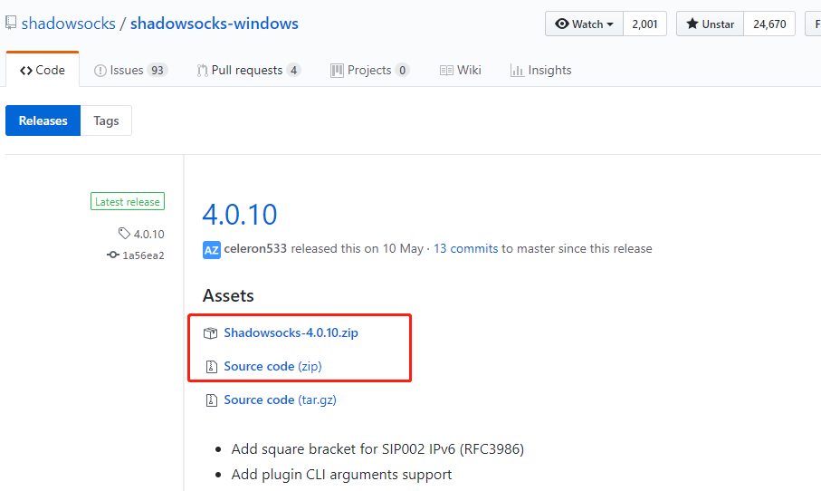
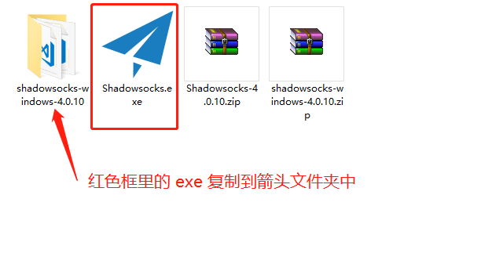
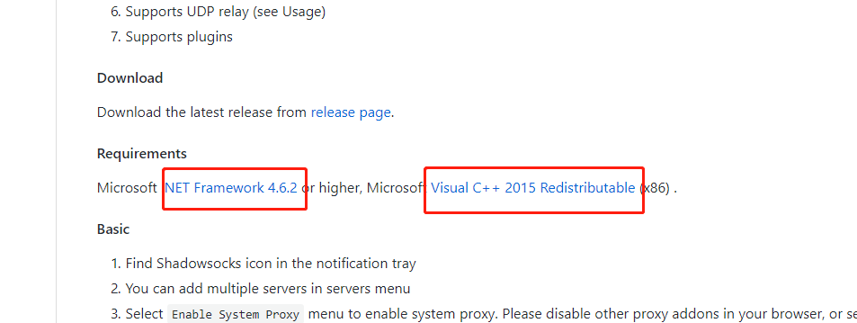
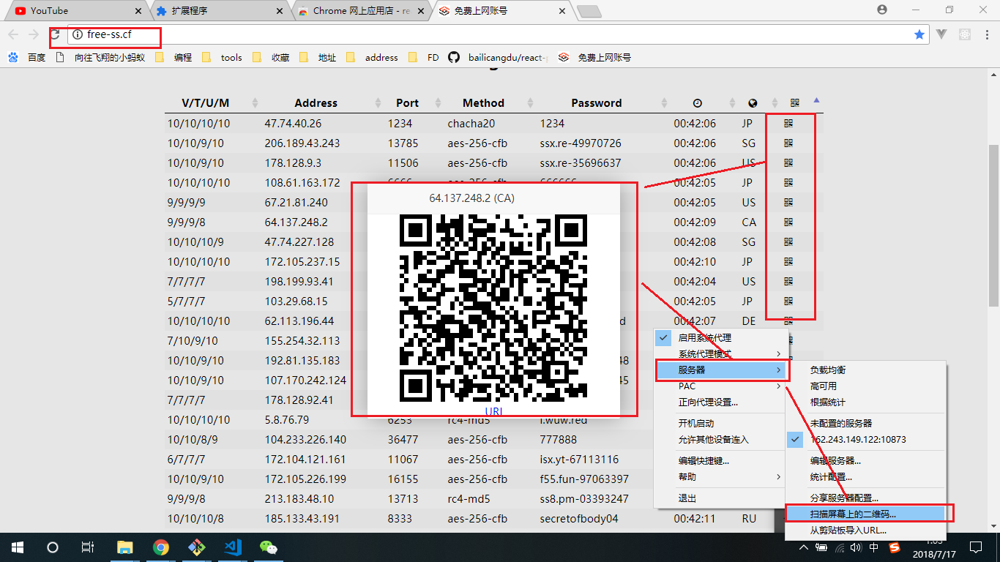
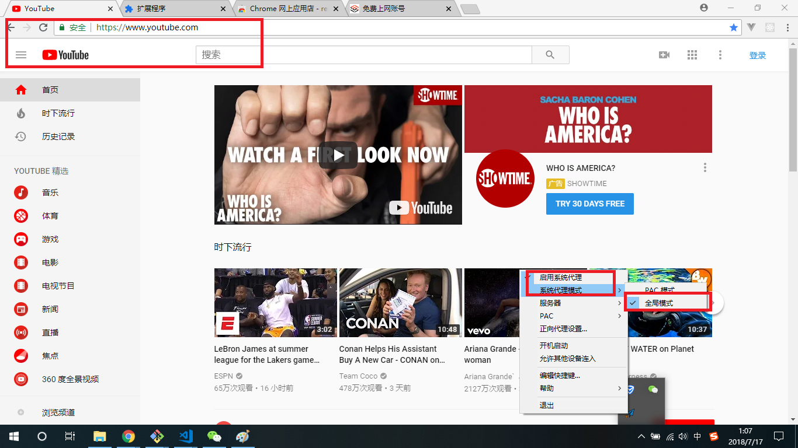

### window翻墙访问外网

#### 1、准备工作

``` js
上网软件
https://github.com/shadowsocks/shadowsocks-windows/releases
补丁下载
https://github.com/shadowsocks/shadowsocks-windows
上网账号
http://free-ss.cf/
```

#### 2、下载软件，解压。

##### 1.下载下图两个压缩包，解压。



##### 2.按照图示，并启动 exe



##### 3.如果软件发不开，请下载补丁安装重新打开[地址](https://github.com/shadowsocks/shadowsocks-windows)



##### 4.使用[免费账号]:http://free-ss.cf/

点击二维码，后扫描。软件自动填写信息，确认即可。


##### 5.使用[免费账号]:http://free-ss.cf/

启用系统代理,代理模式为全局代理即可访问 youtube及其他网站
