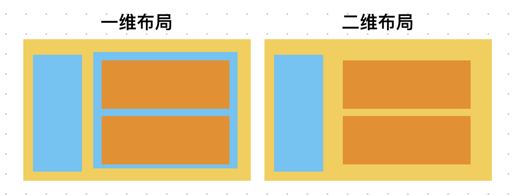
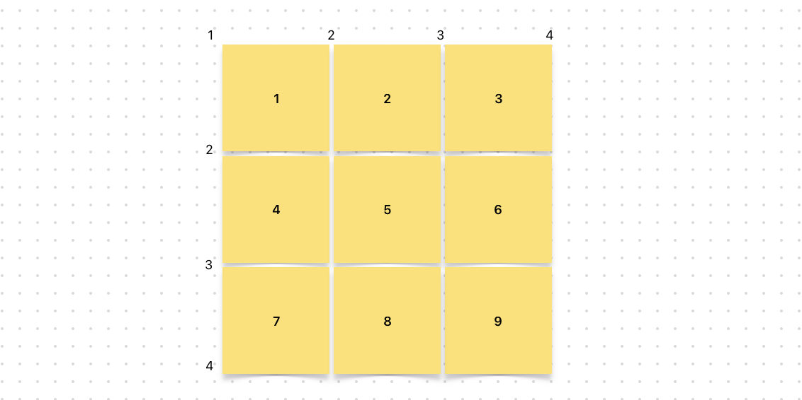

### Grid

#### 1、介绍

CSS Gird布局也叫二维网格布局系统，可用于布局页面主要的区域布局或小型组件。网格是一组相交的水平线和垂直线，它定义了网格的列和行。我们可以指定将网格元素放置在与这些行和列相关的位置上。

#### 2、一维布局 和 二维布局

像流布局和Flex布局，他们都是一维布局。一维布局一次只能处理一个维度上的元素布局，一行或者一列。回想一下，流布局和Flex布局的兄弟节点，是不是都是按照行或者列来显示的。

而**网格布局是二维布局，可以同时处理行和列上的布局**。使用网格布局，兄弟节点可以被指定布局到网格的某个位置。
所以，网格布局相对流布局Flex布局更加的灵活。

下图就是展示了一维布局和二维布局的不同。可以看出，如果布局复杂，一维布局需要增加节点来解决；而二维布局，则不需要，这也是网格布局强大而复杂的原因。



#### 3、概念

父元素

```css
{
  /* 设置为网格布局 */
  display: grid;
  width: 300px;
  height: 400px;

  /* 指定当前容器的行和列后，这里的行和列就是网格轨道。 */
  /* 页面的内容不确定性，内容可能会超过指定的网格轨道个数，网格将会在隐式网格中创建行和列 */
  /* 按照默认，这些轨道将自动定义尺寸，所以会根据它里面的内容改变尺寸。 */
  grid-template-columns: 1fr 1fr 1fr; 
  grid-template-rows: 1fr 1fr 1fr 1fr;

  /* 多行多列的时候我们可以通过 repeat 函数来设置。*/
  grid-template-columns: repeat(3,1fr) ;
  grid-template-rows: repeat(4, 1fr);

  /* 可以设置隐式网格的样式，设置完隐式的，其他就是显示的平分 */
  grid-auto-rows:200px;
  grid-auto-columns:200px;

 
     
  /* 父容器的尺寸是不确定时，我们需要把子元素往父容器中逐个填充，auto-fill */
  /* 下面表示，每一列都是50px，但是具体有几列，需要根据子元素填充的情况来定。*/
  /* 能放下8列，就放8列，不够9列的部分空白。 */
  grid-template-columns: repeat(auto-fill, 50px);

  /* 如果不希望后面有空白，就需要子节点有适当的宽度适配。*/
  /* 子节点不再是固定宽度，而是通过minmax函数指定最小值。*/
  /* 如果容器的行不够整数，那么就按照1:1的比例去适当增宽子节点。*/
  grid-template-columns: repeat(auto-fill, minmax(50px, 1fr));
  }
```

#### 4、Grid隐式网格线



有了网格线，我们可以通过网格线指定跨轨道的网格元素，从而实现网格元素占多行多列的效果。子元素通过`grid-column-start`，`grid-column-end`，`grid-row-start`，`grid-row-end`或者`grid-column`和`grid-row`，或者通过`grid-area`这一个属性来设置来指定元素占据的网格轨道。
这里的属性值不仅可以指定网格线，还可以指定span xx 这个的意思是占据多少网格轨道。这个更符合我们的思维习惯。

子元素

```css
{ 
  /* 如果只占一行或一列，grid-xx-end属性可以不用写 */
  grid-row-start: 1;
  grid-row-end: 2;
  grid-column-start: 1;
  grid-column-end: 4; 

  /* 顺序：row-start / column-start / row-end / column-end  */
  grid-area: 1 / 1 / 2 / 4;
 
  /* grid-row-start 和 grid-row-end 缩写 */
  grid-row: 2 / 4;

  /* span表示占据几行，这里表示从2开始，占据2行，也就是网格线2到4  */
  grid-column: 2 / span 2;
}
```

#### 5、网格单元和网格间距

```css
{
  /* gap 顺序是 row-gap column-gap */
  gap: 10px 10px;

  grid-column-gap: 10px;
  grid-row-gap: 10px;
}
```

#### 6、网格项目重叠

上面讲到，每一个网格项目都可以指定占据的网格单元。如果多个网格项目占据同一个网格单元呢。按照先后顺序，默认情况是后面的DOM节点盖住前面的DOM节点。不过我们可以通过设置z-index来改变覆盖顺序。

#### 7、元素的对齐

Grid布局有以下容器属性用于对齐：

`justify-content`，`justify-item`，`align-content`，`align-item` 

另外，Grid还增加了`place-content`和 `place-item`用于缩写。

子元素对齐属性：`justify-self`，`align-self`，`place-self`。
  
- `justify`是在垂直方向对齐方式
- `align`是水平方向对齐对齐
- `place`是前面两个属性的缩写，先`align`再`justify`
- `content`是容器子元素的对齐
- `item`是子元素所在自己空间的对齐
- `self`是子元素的属性，用于覆盖父容器对应的`item`样式
