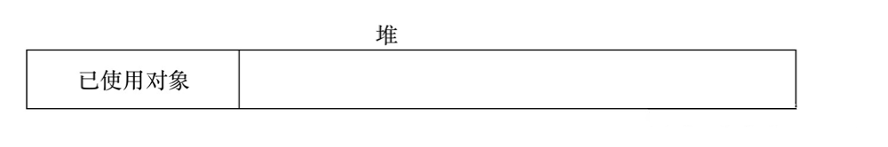
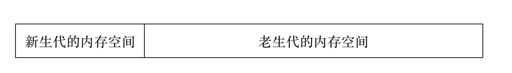
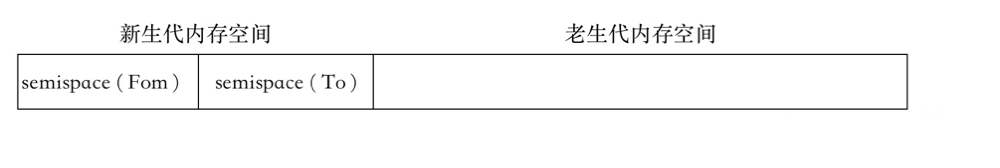
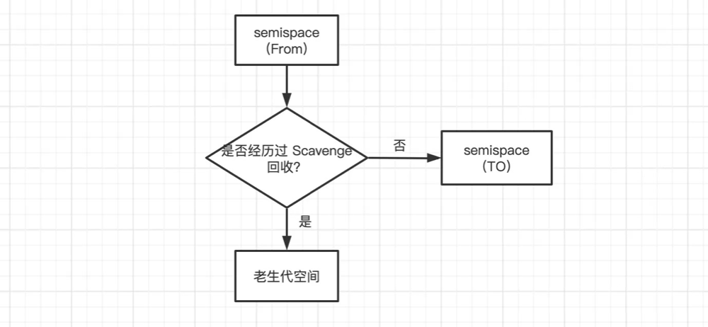
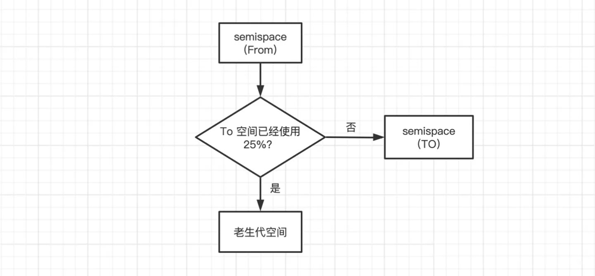
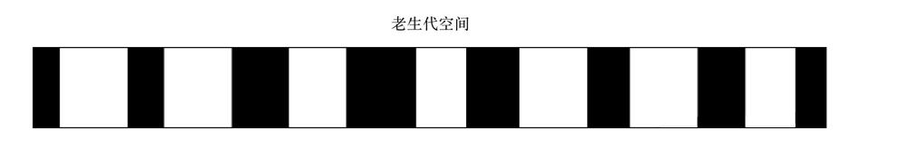
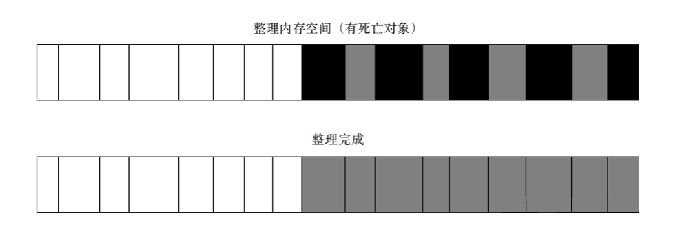
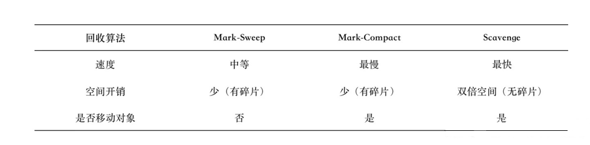

### V8 的垃圾回收机制

[原文地址](https://zhuanlan.zhihu.com/p/520393745),‘抄袭’是为了记录一下。

Node 在发展历程中离不开 V8，在官方的主页介绍中就提到 Node 是一个构建在 Chrome 的 JavaScript 运行时上的平台。Node 在 JavaScript 的执行上直接受益于 V8，可以随着 V8 的升级就能享受到更好的性能或新的语言特性（如 ES5 和 ES6）等，但同时也受 V8 的一些限制。

#### 一、V8 内存的限制

在一般的后端开发语言中，在基本的内存使用上没有什么限制，然而在 Node 中通过JavaScript 使用内存时就会发现只能使用部分内存（64 位系统写约 1.4GB，32 位系统下约为 0.7GB）。在这样的限制下，将会导致 Node 无法直接操作大内存对象，比如无法将一个 2GB 的文件读入内存中进行字符串分析处理，即使物理内存有 32GB，这样在单个 Node 进程的情况下，计算机的内存资源无法得到充分的使用。

造成这个问题的主要原因就在于 Node 基于 V8 构建，所以在 Node 中使用的JavaScript 对象基本上都是通过 V8 自己的方式来进行分配和管理的。V8 的这套内存管理机制在浏览器的应用场景下使用起来绰绰有余，足以胜任前端页面中的所有需求，但在 Node 中，这却限制了开发者随心所欲使用大内存的想法。

尽管在服务器端操作大内存也不是常见的需求场景，但有了限制之后，我们的行为就如同带着镣铐跳舞，如果在实际的应用中不小心触碰到这个界限，会造成进程退出。要知晓 V8 如何限制了内存的用量，则需要回归到 V8 在内存使用上的策略，知晓其原理后，才能避免问题并更好的进行内存管理。

#### 二、V8 的对象分配

在 V8 中，所有的 JavaScript 对象都是通过堆来进行分配的。

当我们在代码中声明变量并赋值时，所使用对象的内存就分配在堆中。**如果已经申请的堆空闲内存不够分配新的对象，将继续申请堆内存，知道堆的大小超过 V8 的限制为止**。

至于 V8 为何要限制堆的大小，表层原因为 V8 最初为浏览器而设计，不太可能遇到用大量内存的场景。对于网页来说，V8 的限制值已经绰绰有余。深层原因是 V8 的垃圾回收机制的限制。按官方的说法，以 1.5GB 的垃圾回收堆内存为例，V8 做一次小的垃圾回收需要 50 毫秒以上，做一次非增量式的垃圾回收甚至要 1 秒以上。这是垃圾回收中引起 JavaScript 线程暂停执行的时间，在这样的时间花销上，应用的性能和响应能力都会直线下降。这样的情况不仅仅后端服务无法接受，前端浏览器也无法接受，因为，在当时的考虑下直接限制堆内存是一个好的选择。

#### 三、V8 主要的垃圾回收算法

V8 的垃圾回收策略主要**基于分代式垃圾回收机制**。

在自动垃圾回收的演变过程中，人们发现没有一种垃圾回收算法能够胜任所有的场景。因为在实际的应用中，对象的生命周期长短不一，不同的算法只能针对特定情况具有最好的效果。现代的垃圾回收算法中按对象的存活时间将内存的垃圾回收进行不同的分代，然后分别对不同分代的内存施以更高效的算法

##### 1.V8 的内存分代

在 V8 中，主要将内存分为**新生代和老生代**两代。**新生代中的对象为存活时间较短的对象，老生代的对象为存活时间较长或常驻内存的对象**。：

V8 堆的整体大小就是新生代所用内存空间加上老生代的内存空间。

可以使用命令行参数进行设置：

* --max-old-space-size 命令行参数用于设置老生代内存空间的最大值。
* --max-new-space-size 命令行参数用于设置新生代内存空间的最大值。

比较遗憾的是，这两个最大值需要在启动时就指定，这意味着，V8 使用的内存没有办法根据使用情况自动扩充，当内存分配过程中超过极限值时，就会引起进程出错。

##### 2.Scavenge 算法

在分代的基础上，新生代中的对象主要通过 `Scavenge` 算法进行垃圾回收，在 `Savenge` 的具体实现中，主要采用 `Cheney` 算法。

`Cheney` 算法是一种采用**复制**的方式实现的垃圾回收算法。**它将堆内存一分为二，每一部分空间称为 semispace。在这两个 semispace 空间中，只有一个处于使用中，另一个处于闲置状态**。处于使用状态的 `semispace` 空间称为 `From` 空间，处于闲置状态的空间称为 `To` 空间。当我们分配对象时，先是在 From 空间中进行分配，当开始进行垃圾回收时，会检查 `From` 空间中的存活对象，这些存活对象将被复制到 To 空间中，而非存活对象占用的空间将会被释放。完成复制后，`From` 空间和 `To` 空间的角色发生对换，简而言之，**在垃圾回收的过程中，就是通过将存活对象在两个 `semispace` 空间之间进行复制**。

`Scavenge` **的缺点是只能使用堆内存中的一半，这是由划分空间和复制机制所决定的**。但 `Scavenge` 由于只复制存活的对象，并且对于生命周期短的场景，存活对象只占少部分，所以它在时间效率上有优异的表现。

由于 `Scavenge` 是典型的牺牲空间换取时间的算法，所以无法大规模的应用到所有的垃圾回收中，但可以发现，`Scavenge` 非常适合应用在新生代中，因为**新生代中对象的生命周期较短**，恰恰适合这个算法。

实际使用的**堆内存是新生代中两个 `semispace` 空间大小和老生代所用内存大小之和**。

当一个对象经过多次复制依然存活时，它将会被认为是生命周期较长的对象。这样较长生命周期的对象随后会被移动到老生代中，采用新的算法进行管理。对象从新生代中移动到老生代中的过程称为**晋升**。

在单纯的 `Scavenge` `过程中，From` 空间中的存活对象会被复制到 `To` 空间中去，然后对 `From` 空间和 `To` 空间进行角色对换（又称翻转）。但在分代式垃圾回收的前提下，`From` 空间中的存活对象在复制到 `To` 空间之前需要进行检查。在一定条件下，需要将存活周期长的对象移动到老生代中，也就是完成对象的晋升。

对象晋升的条件主要有两个，**一个是对象是否经历过 `Scavenge` 回收，一个是 `To` 空间的内存占用比超过限制**。

**在默认情况下，V8 的对象分配主要集中在 `From` 空间中。对象从 `From` 空间中复制到 `To` 空间时，会检查它的内存地址来判断这个对象是否已经经历过一次 `Scavenge` 回收。如果已经经历过了，会将该对象从 `From` 空间复制到老生代空间中，如果没有，则复制到 `To` 空间中。**

**另一个判断条件是 `To` 空间的内存占用比**。当要从 `From` 空间复制一个对象到 `To` 空间时，如果 `To` 空间已经使用了超过 25%，则这个对象直接晋升到老生代空间中

对象晋升后，将会在老生代空间中作为存活周期较长的对象来对待，接收新的回收算法处理。

##### 3. `Mark-Sweep` & `Mark-Compact`

对于老生代中的对象，由于存活对象占较大比重，再采用 `Scavenge` 的方式会有两个问题：一个是存活对象较多，复制存活对象的效率将会很低；另一个问题依然是浪费一半空间的问题。这两个问题导致应对生命周期较长的对象时 `Scavenge` 会显得捉襟见肘。为此，V8 在老生代中主要采用了 `Mark-Sweep` 和 `Mark-Compact` 相结合的方式进行垃圾回收。

`Mark-Sweep` 是**标记清除**的意思，它分为标记和清除两个阶段。与 `Scavenge` 相比，`Mark-Sweep` 并不将内存空间划分为两半，所以不存在浪费一半空间的行为。与 `Scavenge` 复制活着的对象不同，`Mark-Sweep` **在标记阶段遍历堆中的所有对象，并标记活着的对象，在随后的清除阶段 ，只清除没有被标记的对象**。

可以看出来，`Scavenge` 中只复制活着的对象，而 `Mark-Sweep` 只清理死亡对象。活对象在新生代中只占较小部分，死对象在老生代中只占较小部分，这是两种回收方式能高效处理的原因。`Mark-Sweep` 在老生代空间中标记后的示意图如下图，黑色部分标记为死亡的对象：

`Mark-Sweep` **最大的问题是在进行一次标记清除回收后，内存空间会出现不连续的状态**。这种内存碎片会对后续的内存分配造成问题，因为很可能出现需要分配一个大对象的情况，这时所有的碎片空间都无法完成此次分配，就会提前触发垃圾回收，而这次回收是不必要的。

为了解决 `Mark-Sweep` 的内存碎片问题，`Mark-Compact` 被提出来，`Mark-Compact` 是**标记整理**的意思，是在 `Mark-Sweep` 的基础上演变而来的，它们的差别在于对象在标记为死亡后，在整理过程中，将活着的对象往一端移动，移动完成后，直接清理掉边界外的内存。`Mark-Compact` 完成标记并移动存活对象后的示意图如下图，白色格子为存活对象，深色格子为死亡对象，浅色格子为存活对象移动后留下的空洞：

完成移动后，就可以直接清除最右边的存活对象后面的内存区域完成回收。

这里将 `Mark-Sweep` 和 `Mark-Compact` 结合着介绍不仅仅是因为两种策略是递进关系，在 V8 的回收策略中两者是结合使用的，下图是目前介绍到的 3 种主要垃圾回收算法的简单对比：

从表中可以看到，**在 `Mark-Sweep` 和 `Mark-Compact` 之间，由于 `Mark-Compact` 需要移动对象，所以它的执行速度不可能很快，所以在取舍上，V8 主要使用 `Mark-Sweep`，在空间不足以对从新生代中晋升过来的对象进行分配时才使用 `Mark-Compact`**。

##### 4. `Incremental Marking`

为了避免出现 JavaScript 应用逻辑与垃圾回收器看到的不一致的情况，垃圾回收的 3 种基本算法都需要将应用逻辑暂停下来，待执行完垃圾回收后再恢复执行应用逻辑，这种行为被称为“全停顿”（`stop-the-world`）。在 V8 的分代式垃圾回收中，一次小垃圾回收只收集新生代，由于新生代默认配置得较小，且其中存活对象通常较少，所以即便它是全停顿的影响也不大。但 V8 的老生代通常配置得较大，且存活对象较多，全堆垃圾回收（full 垃圾回收）的标记、清理、整理等动作造成的停顿就会比较可怕，需要设法改善。

为了降低全堆垃圾回收带来的停顿时间，V8 先从标记阶段入手，**将原本要一口气停顿完成的动作改为增量标记（`incremental marking`），也就是拆分为许多小“步进”，每做完一“步进”就让 `JavaScript` 应用逻辑执行一会，垃圾回收与应用逻辑交替执行直到标记阶段完成**。

V8 在经过增量标记的改进后，垃圾回收的最大停顿时间可以减少到原本的 1/6 左右。

V8 后续还引入了延迟清理（`lazy sweeping`）与增量式整理（`incremental compaction`），让清理与整理动作也变成增量式的。同时还计划引入**并行标记**与**并行整理**，进一步利用多核性能降低每次停顿的时间。

#### 四、小结

从 V8 的自动垃圾回收机制的设计角度可以看到，V8 对内存使用进行限制的缘由。新生代设计为一个较小的内存空间是合理的，而老生代空间过大对于垃圾回收并无特别意义。V8 对内存限制的设置对 Chrome 浏览器这种每个选项卡页面使用一个 V8 实例而言，内存的使用时绰绰有余了。对于 Node 编写的服务器端来说，内存限制也并不影响正常场景下的使用。但是对 V8 的垃圾回收特点和 JavaScript 在单线程上的执行情况，垃圾回收时影响性能的原因之一，想要高性能能的执行效率，需要注意让垃圾回收尽量少的执行，尤其是全堆垃圾回收。

以 Web 服务器中的会话实现为例，一般通过内存来存储，但在访问量大的时候会导致老生代中存活对象骤增，不仅造成清理/整理过程费时，还会造成内存紧张，甚至溢出。
